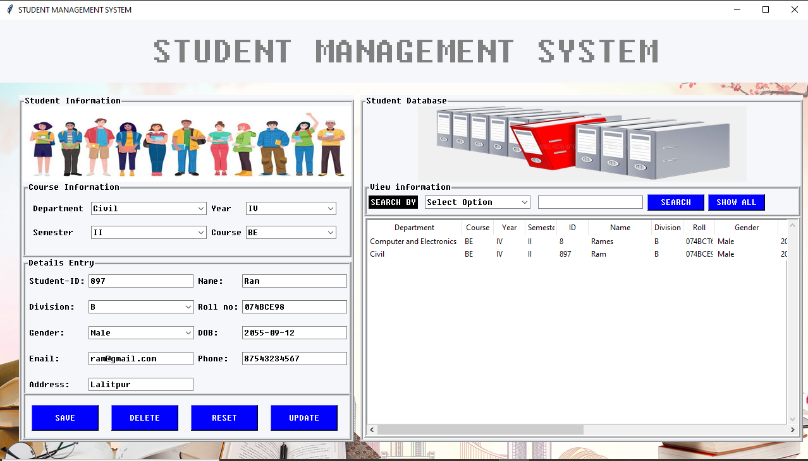

# Student Management System

This project is a Student Management System implemented in Python with a SQL database backend. It provides a graphical user interface (GUI) using the tkinter package for easy interaction.

## Features

- **Student Registration**: Add new students to the system with relevant details such as name, age, grade, etc.
- **Course Enrollment**: Enroll students in various courses offered by the institution.
- **Grade Management**: Record and manage student grades for different assignments, quizzes, and exams.
- **Search and Filter**: Easily search for students or courses and filter data based on different criteria.
- **Database Integration**: Utilizes SQL database backend for storing and managing student and course information.

## Screenshots

